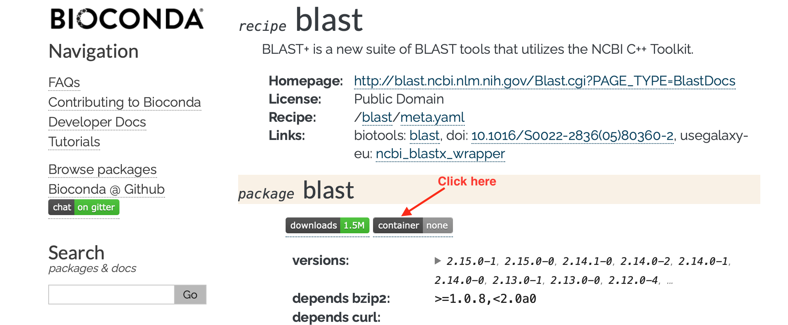
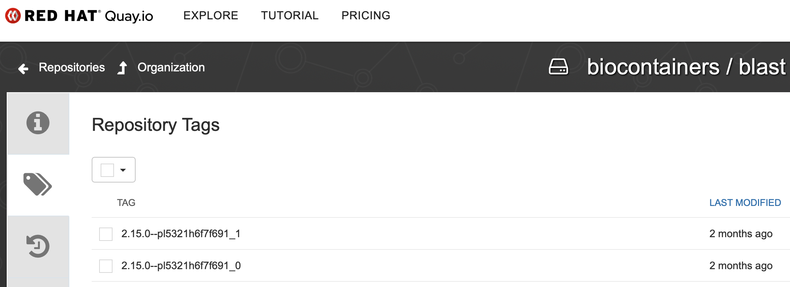
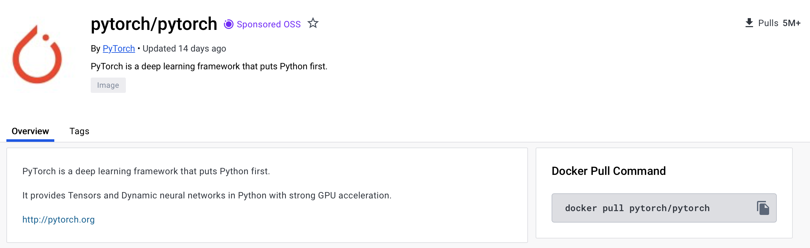

## singularity/apptainer pull
### Syntax
Download or build a container from a given URI. 
```
$ singularity/apptainer pull [output file] <URI>
```

### Blast
You can find almost all bioinformatics applications from BioContainer's [Package Index](https://bioconda.github.io/conda-package_index.html)

[Blast](http://blast.ncbi.nlm.nih.gov/Blast.cgi?PAGE_TYPE=BlastDocs) is one of the most popular bioinformatics applications. Here is the guide about how to pull the latest version (2.15.0) from BioContainers and Docker Hub. 

#### Biocontainers
Bioconda is integrated with BioContainers. You can easily find the blast containers from its [bioconda page](https://bioconda.github.io/recipes/blast/README.html#package-blast).

From the instruction, the pull command is listed below:
```
docker pull quay.io/biocontainers/blast:<tag>
(see `blast/tags`_ for valid values for ``<tag>``)
```

You can find the tags by clicking `container` on top of the page as illutrated in the below figure. 



There are different tags for each version and multiple containers/tags even exist for the same application version. It is common practice to select the ones that were last modified.



To pull the image from BioContainers, we just need to run the below command:
```
## Default
singularity pull docker://quay.io/biocontainers/blast:2.15.0--pl5321h6f7f691_1

## To give a customerized output name
singularity pull blast_2.15.0.sif docker://quay.io/biocontainers/blast:2.15.0--pl5321h6f7f691_1
```

#### Docker hub
Besides BioContainers, I can also pull image from the largest container registry Docker hub. [This container](https://hub.docker.com/r/ncbi/blast/tags) may be even better, because it is the official container image from NCBI. 

To pull the blast image from Docker hub, you can simply use the following command.
```
singularity pull docker://ncbi/blast:2.15.0
```

### Pytorch
[PyTorch](https://pytorch.org) is a powerful open-source machine learning framework based on the Python programming language and the Torch library. It's widely used for deep learning, a type of machine learning that builds complex models like artificial neural networks for tasks like image recognition, natural language processing, and more.
If you want to use PyTorch, simply pull the [official container image](https://hub.docker.com/r/pytorch/pytorch) from Docker Hub. 


```
singularity pull docker://pytorch/pytorch:2.1.2-cuda11.8-cudnn8-runtime
```

## singularity/apptainer shell

## syntax
```
$ singularity/apptainer shell image.sif
```

Let's go inside the pulled `blast` container.  

```
$ singularity shell bowtie2_v2_4_1.sif 
Singularity> more /etc/os-release 
PRETTY_NAME="Debian GNU/Linux 12 (bookworm)"
NAME="Debian GNU/Linux"
VERSION_ID="12"
VERSION="12 (bookworm)"
VERSION_CODENAME=bookworm
ID=debian
HOME_URL="https://www.debian.org/"
SUPPORT_URL="https://www.debian.org/support"
BUG_REPORT_URL="https://bugs.debian.org/"

Singularity> which blastp
/usr/local/bin/blastp

Singularity> ls /
apps         boot         dev          etc          lib          linuxrc      mnt          proc         run          scratch      srv          tmp          var
bin          depot        environment  home         lib64        media        opt          root         sbin         singularity  sys          usr
```
From `ls /`, we can see that Singularity automatically binds `apps`, `depot`, `home`, `scratch`, `tmp` into the container.   


Exit from the container shell when done inspecting
```
Singularity> exit
$                          # back to your regular shell prompt
```